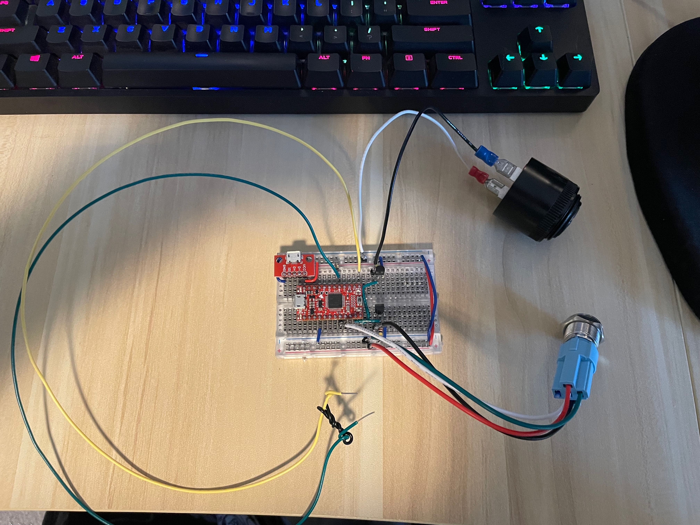
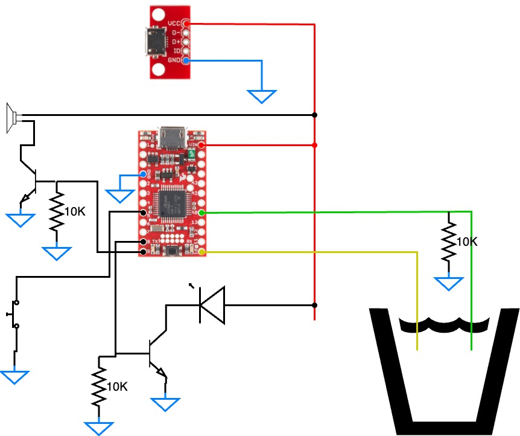
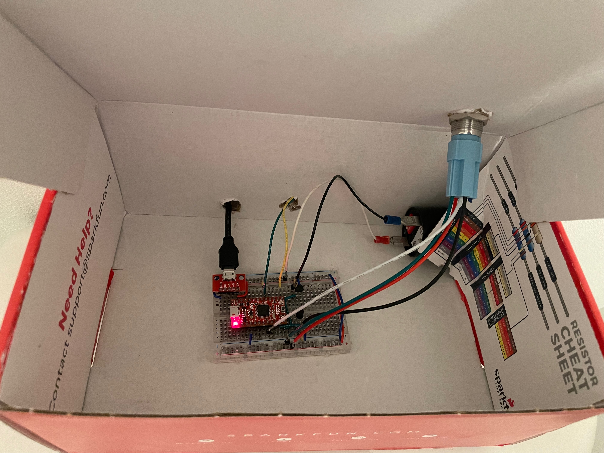
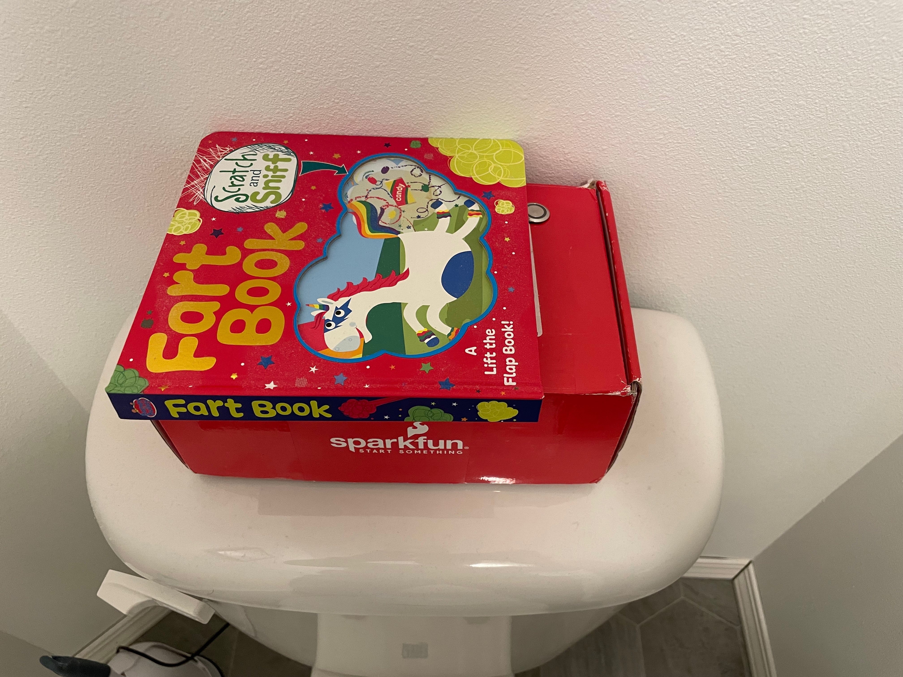

# Toilet Monitor

A simple Toilet Monitor to check that the toilet reservoir fills after a flush.

## Firmware Dependencies

To get the Arduino environment setup from scratch, follow the [Sparkfun SAMD21 Mini/Dev Breakout Hookup Guide](https://learn.sparkfun.com/tutorials/samd21-minidev-breakout-hookup-guide).  After Arduio IDE is setup, open the `.ino` file from this repository in Ardunio IDE.

[Button v1.0.0](https://github.com/madleech/Button)

The Button library can be installed through the Arduino IDE Library Manager.  Search for Button by Michael Adams

## Parts List

All parts were exclusively purchased on [Sparkfun](https://www.sparkfun.com/).

| Part | Qty | URL |
| :---- | :---: | :--- |
|SAMD21 Mini Breakout|1|https://www.sparkfun.com/products/13664|
|microB USB Breakout|1|https://www.sparkfun.com/products/12035|
|Transistor - NPN|2|https://www.sparkfun.com/products/13689|
|Metal Pushbutton|1|https://www.sparkfun.com/products/11970|
|Large Piezo Alarm - 16 Tone|1|https://www.sparkfun.com/products/13939|
|10k Ohm resistor|3|https://www.sparkfun.com/products/14491|
|Breadboard|1|https://www.sparkfun.com/products/9567|
|Break away headers|(variable)|https://www.sparkfun.com/products/116|
|Female quick disconnects (for speaker connection)|2|https://www.sparkfun.com/products/14407|
|Any box you have that can fit all the components (an old smartphone box works well)|1|N/A|
|microB USB to USB type A cable and wall adapter|1|You probably have several already|

Also required are solid core wires of various colors (optional) for breadboard wiring and stranded core wires for connecting to the alarm speaker (I find that stranded core is easier for something that needs to be a bit flexible).  The probe into the toilet resevoir should be a length of solid core wires long enough to dip a couple inches into the water of the toilet reservoir, but short enough that when the toilet is flushed the wires are no longer submerged.  It is recommended to expose a short length of wire at the end that will be submerged and use a short length of wire or twist tie to keep both ends from touching but also to keep them from drifting too far apart (see picture).

NOTE: You don't necessarily need the microB USB Breakout as you can connect directly to the SAMD21 Mini, but it's an easy way to isolate power from a USB cable.

NOTE2: You probably don't even need USB power at all and could use a battery bank instead.  I have not tried this yet, but it's an option if you don't have an outlet near your toilet.

## Schematic

NOTE: The LED and button are the same component from the Metal Pushbutton in the part list.  The button comes with 5 wires, but only 4 are used.  I snipped the unused wire off.

### Programming the SAMD21

Use the USB connector directly on the SAMD21 Mini for programming.

## Issues and Feedback

Feel free to open an issue in this repo for any issues, feedback, or improvements.

## Images

[Video in Action](https://youtu.be/igjCw8AprKY)

## License

MIT License

Copyright (c) 2023 Jacob Preston

Permission is hereby granted, free of charge, to any person obtaining a copy
of this software and associated documentation files (the "Software"), to deal
in the Software without restriction, including without limitation the rights
to use, copy, modify, merge, publish, distribute, sublicense, and/or sell
copies of the Software, and to permit persons to whom the Software is
furnished to do so, subject to the following conditions:

The above copyright notice and this permission notice shall be included in all
copies or substantial portions of the Software.

THE SOFTWARE IS PROVIDED "AS IS", WITHOUT WARRANTY OF ANY KIND, EXPRESS OR
IMPLIED, INCLUDING BUT NOT LIMITED TO THE WARRANTIES OF MERCHANTABILITY,
FITNESS FOR A PARTICULAR PURPOSE AND NONINFRINGEMENT. IN NO EVENT SHALL THE
AUTHORS OR COPYRIGHT HOLDERS BE LIABLE FOR ANY CLAIM, DAMAGES OR OTHER
LIABILITY, WHETHER IN AN ACTION OF CONTRACT, TORT OR OTHERWISE, ARISING FROM,
OUT OF OR IN CONNECTION WITH THE SOFTWARE OR THE USE OR OTHER DEALINGS IN THE
SOFTWARE.
